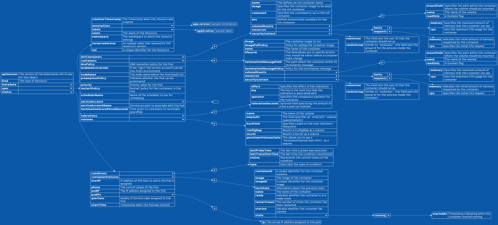

# Kubernetes Pod Fields explanation  

## Table of Contents   
1. [ Fields explanation](#fieldsExplanationHead)
2. [ More information about fields ](#moreInformationAboutFields)
3. [ Pod Fields explanation diagrammatically ](#diagrammatically)
4. [ Contact Information 📧 ](#contact)
5. [ Feedback Welcome 🌟 ](#feedback)
 
## Fields explanation  

1. **apiVersion:** *The version of the Kubernetes API to use for this object.*  
2. **kind:** *The type of Resource.*   
3. **metadata:** *Holds information about the resource.* [More](#metadata)   
4. &emsp;&emsp;**creationTimestamp:** *The timestamp when the resource was created.*   
5. &emsp;&emsp;**annotations:** *Allow you to attach arbitrary metadata to the resource.* [More](#annotations)   
6. &emsp;&emsp;&emsp;&emsp;**app.version:** *sample Annotation*   
7. &emsp;&emsp;**labels:** *Key-value pairs used to organize and select Pods.*  
8. &emsp;&emsp;&emsp;&emsp;**application:** *sample label*   
9. &emsp;&emsp;**name:** *The name of the Resource.*   
10. &emsp;&emsp;**namespace:** *The namespace to which the resource belongs.*   
11. &emsp;&emsp;**resourceVersion:** *An opaque value that represents the resource's version.*    
12. &emsp;&emsp;**uid:** *A unique identifier for the Resource.*   
13. **spec:**  *It stands for "specification" and is used to describe the desired state of a Kubernetes resource* [More](#spec)    
14. &emsp;&emsp;**initContainers:** *This field is a list that specifies the init containers for the Pod.* [More](#initContainers)    
15.  &emsp;&emsp;-&emsp;&emsp;**name:** *This defines an init container name.* [More](#initContainersName)   
16.  &emsp;&emsp;&emsp;&emsp;**image:** *Specifies the container image to be used for the init container.*  
17. &emsp;&emsp;&emsp;&emsp;**command:** *Specifies the command to run in the init container.*
18. &emsp;&emsp;&emsp;&emsp;**env:** *Defines environment variables for the init container.*
19. &emsp;&emsp;&emsp;&emsp;**volumeMounts:** *This is a list that defines the volume mounts for the init container.* [More](#volemeMounts)  
20. &emsp;&emsp;&emsp;&emsp;-&emsp;&emsp;**mountPath:** *Specifies the path within the container where the volume should be mounted.*  
21. &emsp;&emsp;&emsp;&emsp;&emsp;&emsp;**name:** *The name of the volume.* [More](#volemeMountsName)   
22. &emsp;&emsp;&emsp;&emsp;&emsp;&emsp;**readOnly:** *A boolean flag.* [More](#volemereadOnly)  
23. &emsp;&emsp;&emsp;&emsp;**resources:** *Defines resource requests and limits for the init container.* [More](#resources)  
24. &emsp;&emsp;&emsp;&emsp;&emsp;&emsp;**limits:** *This section allows you to set upper bounds, or limits.* [More](#resourceslimits) 
25. &emsp;&emsp;&emsp;&emsp;&emsp;&emsp;&emsp;&emsp;**memory:** *Specifies the maximum amount of memory that the container can use.* [More](#resourceslimitsmem)   
26. &emsp;&emsp;&emsp;&emsp;&emsp;&emsp;&emsp;&emsp;**cpu:** *Sets the maximum CPU usage for the container.* [More](#resourceslimitscpu) 
27. &emsp;&emsp;&emsp;&emsp;&emsp;&emsp;**requests:** *This section defines the amount of resources that a container initially requests.* [More](#resourcesrequest)  
28. &emsp;&emsp;&emsp;&emsp;&emsp;&emsp;&emsp;&emsp;**memory:** *Indicates the initial amount of memory requested by the container.* [More](#resourcesrequestmem)   
29. &emsp;&emsp;&emsp;&emsp;&emsp;&emsp;&emsp;&emsp;**cpu:** *Specifies the initial CPU request* [More](#resourcesrequestcpu)   
30. &emsp;&emsp;&emsp;&emsp;**securityContext:** *The securityContext field is used to configure security-related settings for a container.* [More](#securityContext)    
31. &emsp;&emsp;&emsp;&emsp;&emsp;&emsp;**runAsUser:** *This field sets the user ID that the container should run as.* [More](#runAsUser)  
32. &emsp;&emsp;&emsp;&emsp;&emsp;&emsp;**runAsGroup:** *Similar to `runAsUser`, this field sets the group ID for the process inside the container.* [More](#runAsGroup)  
33. &emsp;&emsp;**containers:** *List of containers within the Pod.*  
34. &emsp;&emsp;-&emsp;&emsp;**image:** *The container image to run.*   
35. &emsp;&emsp;&emsp;&emsp;**imagePullPolicy:** *Policy for pulling the container image.*   
36. &emsp;&emsp;&emsp;&emsp;**name:** *The name of the container.*   
37. &emsp;&emsp;&emsp;&emsp;**lifecycle:** *This field allows you to specify actions that should be taken before a container state change* [More](#lifecycle)    
38. &emsp;&emsp;&emsp;&emsp;**terminationMessagePath:** *The path where the container writes its termination message.*   
39. &emsp;&emsp;&emsp;&emsp;**terminationMessagePolicy:** *Policy for the termination message.*  
40. &emsp;&emsp;&emsp;&emsp;**volumeMounts:** *This is a list that defines the volume mounts for the container.* [More](#volemeMounts)  
41. &emsp;&emsp;&emsp;&emsp;-&emsp;&emsp;**mountPath:** *Specifies the path within the container where the volume should be mounted.*  
42. &emsp;&emsp;&emsp;&emsp;&emsp;&emsp;**name:** *The name of the volume.* [More](#volemeMountsName)   
43. &emsp;&emsp;&emsp;&emsp;&emsp;&emsp;**readOnly:** *A boolean flag.* [More](#volemereadOnly)  
44. &emsp;&emsp;&emsp;&emsp;**resources:** *Defines resource requests and limits for the container.* [More](#resources)  
45. &emsp;&emsp;&emsp;&emsp;&emsp;&emsp;**limits:** *This section allows you to set upper bounds, or limits.* [More](#resourceslimits) 
46. &emsp;&emsp;&emsp;&emsp;&emsp;&emsp;&emsp;&emsp;**memory:** *Specifies the maximum amount of memory that the container can use.* [More](#resourceslimitsmem)   
47. &emsp;&emsp;&emsp;&emsp;&emsp;&emsp;&emsp;&emsp;**cpu:** *Sets the maximum CPU usage for the container.* [More](#resourceslimitscpu) 
48. &emsp;&emsp;&emsp;&emsp;&emsp;&emsp;**requests:** *This section defines the amount of resources that a container initially requests.* [More](#resourcesrequest)  
49. &emsp;&emsp;&emsp;&emsp;&emsp;&emsp;&emsp;&emsp;**memory:** *Indicates the initial amount of memory requested by the container.* [More](#resourcesrequestmem)  
50. &emsp;&emsp;&emsp;&emsp;&emsp;&emsp;&emsp;&emsp;**cpu:** *Specifies the initial CPU request* [More](#resourcesrequestcpu)   
51. &emsp;&emsp;&emsp;&emsp;**securityContext:** *The securityContext field is used to configure security-related settings for a container.* [More](#securityContext)    
52. &emsp;&emsp;&emsp;&emsp;&emsp;&emsp;**runAsUser:** *This field sets the user ID that the container should run as.* [More](#runAsUser)  
53. &emsp;&emsp;&emsp;&emsp;&emsp;&emsp;**runAsGroup:** *Similar to `runAsUser`, this field sets the group ID for the process inside the container.* [More](#runAsGroup)  
54. &emsp;&emsp;**dnsPolicy:** *DNS resolution policy for the Pod.*  
55. &emsp;&emsp;**enableServiceLinks:** *If set, inject the service account's secret into Pod's environment.*  
56. &emsp;&emsp;**nodeName:**  *The node name where the Pod should run.*  
57. &emsp;&emsp;**preemptionPolicy:** *Indicates whether the Pod can be preempted.*  
58. &emsp;&emsp;**priority:** *Priority value for the Pod.*  
59. &emsp;&emsp;**restartPolicy:** *Restart policy for the containers in the Pod.*  
60. &emsp;&emsp;**schedulerName:** *Name of the scheduler to use for scheduling.*  
61. &emsp;&emsp;**serviceAccount:**  
62. &emsp;&emsp;**serviceAccountName:** *Service account to associate with the Pod.*  
63. &emsp;&emsp;**terminationGracePeriodSeconds:** *Time given to containers to terminate gracefully.*  
64. &emsp;&emsp;**tolerations:** *List of tolerations for scheduling.*  
65. &emsp;&emsp;-&emsp;&emsp;**effect:** *Specifies the effect of the toleration.* [More](#tolerationEffect)   
66. &emsp;&emsp;&emsp;&emsp;**key:** *The key is the taint key that the toleration is associated with.* [More](#tolerationKey)   
67. &emsp;&emsp;&emsp;&emsp;**operator:** *Specifies the comparison operator for the toleration.* [More](#tolerationOperator)  
68. &emsp;&emsp;&emsp;&emsp;**tolerationSeconds:** *Optional field specifying the amount of time a pod can tolerate* [More](#tolerationSeconds)  
69. &emsp;&emsp;**volumes:** *List of volumes that can be mounted by containers.*  
70. &emsp;&emsp;&emsp;-&emsp;**name:** *The name of the volume.* [More](#volumesname)     
71. &emsp;&emsp;&emsp;&emsp;**emptyDir:** *This field specifies an `emptyDir` volume type.* [More](emptyDir)   
72. &emsp;&emsp;&emsp;&emsp;**hostPath:** *Specifies a path on the host machine's filesystem.* [More](#hostPath)  
73. &emsp;&emsp;&emsp;&emsp;**configMap:** *Mounts a ConfigMap as a volume.* [More](#configMap)    
74. &emsp;&emsp;&emsp;&emsp;**secret:** *Mounts a Secret as a volume.* [More](#secret)   
75. &emsp;&emsp;&emsp;&emsp;**persistentVolumeClaim:** *This allows you to use a `PersistentVolumeClaim (PVC)` as a volume.* [More](#persistentVolumeClaim)  
76. **status:**  
77. &emsp;&emsp;**conditions:** *Conditions represent the latest available observations of the Pod's current state.*  
78. &emsp;&emsp;- &emsp;&emsp;**lastProbeTime:** *The last time a probe was executed* [More](#statuslastProbeTime)   
79. &emsp;&emsp;&emsp;&emsp;**lastTransitionTime:** *The last time the condition transitioned.* [More](#statuslastTransitionTime)  
80. &emsp;&emsp;&emsp;&emsp;**status:** *Represents the current status of the condition.* [More](#statusStatus)  
81. &emsp;&emsp;&emsp;&emsp;**type:** *Describes the type of condition.*  [More](#statusType) 
82. &emsp;&emsp;**containerStatuses:** *The status of each container in the Pod.*  
83. &emsp;&emsp;-&emsp;&emsp;**containerID:** *A unique identifier for the container instance.* [More](#statusContainerID)   
84. &emsp;&emsp;&emsp;&emsp;**image:** *The image of the container.*  
85. &emsp;&emsp;&emsp;&emsp;**imageID:** *A unique identifier for the container image.* [More](#statusImageID)  
86. &emsp;&emsp;&emsp;&emsp;**lastState:** *Information about the previous state.* [More](#statusLastState)  
87. &emsp;&emsp;&emsp;&emsp;**name:** *The name of the container.* [More](#statuscontainername)  
88. &emsp;&emsp;&emsp;&emsp;**ready:** *Indicates whether the container is in a ready state.* [More](#statuscontainerready)  
89. &emsp;&emsp;&emsp;&emsp;**restartCount:** *The number of times the container has been restarted.*  
90. &emsp;&emsp;&emsp;&emsp;**started:** *ndicates whether the container has started.* [More](#statuscontainerstarted)  
91. &emsp;&emsp;&emsp;&emsp;**state:** *Describes the current state of the container.* [More](#statuscontainerstate)  
92. &emsp;&emsp;&emsp;&emsp;&emsp;**running:** *Describes the container state when it's currently running.*  
93. &emsp;&emsp;&emsp;&emsp;&emsp;&emsp;**startedAt:** *Timestamp indicating when the container started running*  
94. &emsp;&emsp;**hostIP:** *IP address of the host to which the Pod is assigned.*  
95. &emsp;&emsp;**phase:** *The current phase of the Pod.* [More](#statuscontainerphase)  
96. &emsp;&emsp;**podIP:** *The IP address assigned to the Pod.*  
97. &emsp;&emsp;**podIPs:** *A list of IP addresses assigned to the pod.* [More](#statuscontainerpodIps)  
98. &emsp;&emsp;-&emsp;**ip:** *The actual IP address assigned to the pod.*   
99. &emsp;&emsp;**qosClass:** *Quality of Service class assigned to the Pod.* 
100. &emsp;&emsp;**startTime:** *Timestamp when the Pod was started.*  

---

  <a href="#fieldsexplanation">Go to Top ▲</a>

   

## More information about fields:  

   
3. **metadata:** This is the top-level field in the Kubernetes resource definition that holds information about the resource.   

   
5. **annotations:** *Annotations allow you to attach arbitrary metadata to the resource. They are not used by Kubernetes itself but can be leveraged by tools, controllers, or custom scripts to provide additional context or configuration.*     

   
13. **spec:**
The `spec` field provides a declarative way to define how the resources should behave and what their configuration should be. When you create or update a resource, Kubernetes uses the information in the `spec` field to reconcile the actual state with the desired state, making adjustments as needed.

The exact contents of the `spec` field depend on the type of resource you are defining. It encapsulates the configuration, parameters, and other details that dictate how the resource should function within the Kubernetes cluster. 

  <a href="#fieldsexplanation">Go to Top ▲</a>

   
14. **initContainers:** This field is a list that specifies the init containers for the Pod. Init containers are executed before the main containers and are commonly used for setup or initialization tasks.   

   
15. **name:** (InitContainerName)This defines an init container name. The name field is used to identify the init container within the Pod.

  <a href="#fieldsexplanation">Go to Top ▲</a>

   
23 & 44. **resources:** Defines resource requests and limits for the init-container, container, or mutli container. This controls the amount of CPU and memory resources the init container can use.   

   
24 & 45. **limits:** This section allows you to set upper bounds, or limits, on the amount of resources that a container can consume. These limits are enforced by the Kubernetes scheduler and the container runtime.  

   
25 & 46. **memory:** (Resources Limit Memory)Specifies the maximum amount of memory that the container can use. You can use suffixes like `Ki`, `Mi`, `Gi`, etc., to denote kilobytes, megabytes, gigabytes, etc.  

   
26 & 47. **cpu:** (Resource Limit CPU)Sets the maximum CPU usage for the container. You can specify this value as a decimal fraction, such as `0.5` for half of a CPU core.  

   
27 & 48. **requests:** This section defines the amount of resources that a container initially requests when it is scheduled onto a node. It represents the guaranteed resources that will be available to the container.   

   
28 & 49. **memory:** (Resource Request Memory)Indicates the initial amount of memory requested by the container. Similar to `limits`, you can use suffixes for different units.   

  
29 & 50. **cpu:** (Resource Request CPU)Specifies the initial CPU request for the container. It is also expressed as a decimal fraction.   

  <a href="#fieldsexplanation">Go to Top ▲</a>

  
30 & 51. **securityContext:** The securityContext field is used to configure security-related settings for a container in Kubernetes. Specifically, the `runAsUser` and `runAsGroup` fields are part of this configuration.    

  
31 & 52. **runAsUser:** This field sets the user ID that the container should run as. It defines the UID (User ID) for the process inside the container. It's a security best practice to run processes inside containers as non-root users to minimize the impact of security vulnerabilities.    

  
32 & 53. **runAsGroup:** Similar to `runAsUser`, this field sets the group ID for the process inside the container. It defines the GID (Group ID) for the process. 

  
37. **lifecycle:** This field allows you to specify actions that should be taken before a container starts (`preStop`) or after it stops (`postStart`).   

  <a href="#fieldsexplanation">Go to Top ▲</a>

   
19 & 40. **volumeMounts:** This is a list that defines the volume mounts for the container. Each item in the list represents a separate volume mount.   

  
21 & 42. **name:** (Volume mount name)The name of the volume, which should match the name of a volume defined in the `volumes` section of the same pod specification.    

   
22 & 43. **readOnly:** A boolean flag indicating whether the volume should be mounted as read-only (`true`) or read-write (`false`).

  <a href="#fieldsexplanation">Go to Top ▲</a>

  
65. **effect:** *Specifies the effect of the toleration. Possible values are `NoSchedule`, `PreferNoSchedule`, or `NoExecute`. This field indicates what action should be taken if the toleration conditions are met.* 

  
66. **key:** The key is the taint key that the toleration is associated with. A taint is a key-value pair associated with a node that affects pod scheduling.  

  
67. **operator:** Specifies the comparison operator for the toleration. Possible values are "Equal" or "Exists." If set to "Equal," the toleration is considered to match only if the key and value are equal. If set to "Exists," the toleration is considered to match if the key exists, regardless of the value.   

  
68. **tolerationSeconds:** Optional field specifying the amount of time a pod can tolerate being scheduled onto a node with the corresponding taint. After this time, the pod will be evicted if it cannot be scheduled. 

  <a href="#fieldsexplanation">Go to Top ▲</a>

  
70. **name:** The name of the volume. This is used to reference the volume in other parts of the pod specification, such as in the `volumeMounts` section of a container.   

  
71. **emptyDir:** This field specifies an `emptyDir` volume type. An emptyDir volume is initially empty and is created when a Pod is assigned to a node. It can be used for temporary storage that is shared among containers in the same Pod.  

  
72. **hostPath:** Specifies a path on the host machine's filesystem. This volume type mounts a directory or file into a Pod.  

  
73. **configMap:** Mounts a ConfigMap as a volume. ConfigMaps are used to store configuration data as key-value pairs.   

  
74. **secret:** Mounts a Secret as a volume. Secrets are used to store sensitive information, such as passwords or API keys.  

  
75. **persistentVolumeClaim:** This allows you to use a PersistentVolumeClaim (PVC) as a volume. PVCs provide a way to request durable storage.   

  <a href="#fieldsexplanation">Go to Top ▲</a>

  
78. **lastProbeTime:** This field typically contains the timestamp of the last time a probe was executed to check the condition. 

  
79. **lastTransitionTime:** This field usually holds the timestamp of the last time the condition transitioned from one status to another. It indicates when a change in the condition occurred.   

  
80. **status:** Represents the current status of the condition. It could be "True," "False," or "Unknown," indicating whether the condition is currently satisfied, not satisfied, or the status is unknown.   

  
81. **type:** Describes the type of condition. This field helps identify what aspect of the resource's status is being represented. For example, it might be related to readiness, liveness, or some other custom condition.   

  
83. **containerID:** *A unique identifier for the container instance. This ID is typically specific to the container runtime (like Docker).*   

  
85. **imageID:** A unique identifier for the container image. Like `containerID`, it's specific to the container runtime.    

  <a href="#fieldsexplanation">Go to Top ▲</a>

  
86. **lastState:** Information about the previous state of the container before the current status.    

  
87. **name:** The name of the container as defined in the pod specification.   

  
88. **ready:** Indicates whether the container is in a ready state. It's usually a boolean value ("true" or "false").   

  
90. **started:** ndicates whether the container has started. It's usually a boolean value ("true" or "false").    

  
91. **state:** Describes the current state of the container.   

  
95. **phase:** The current phase of the Pod (Pending, Running, Succeeded, Failed, Unknown).   
 

97. **podIPs:** A list of IP addresses assigned to the pod. It's common to have only one IP address in this list, but in certain scenarios (e.g., pods with multiple network interfaces), there might be more than one.  

  <a href="#fieldsexplanation">Go to Top ▲</a>

  

---  

## Pod Fields explanation diagrammatically  

  

  <a href="#fieldsexplanation">Go to Top ▲</a>

  

---
  

## Contact Information  
If you have any questions or feedback, feel free to reach out:  

- Email: muppedaanvesh@gmail.com 📧  
- LinkedIn: [@Anvesh](https://www.linkedin.com/in/anvesh-muppeda-5a0a83167) 🌐  
- GitHub Issues: [Project Issues](https://github.com/anveshmuppeda/kubectl-helper/issues) 🚀 

--- 

  <a href="#fieldsexplanation">Go to Top ▲</a>

  
   

## Feedback Welcome!  

We welcome your feedback and suggestions! If you encounter any issues or have ideas for improvements, please open an issue on our [GitHub repository](https://github.com/anveshmuppeda/kubectl-helper/issues). 🚀   

  <a href="#fieldsexplanation">Go to Top ▲</a>

 
---